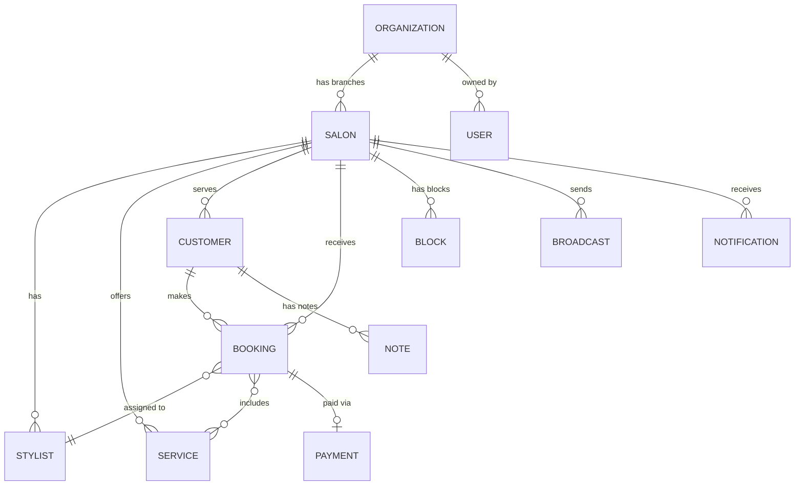

# ChairBook.in — Phased Development Roadmap

A salon booking & CRM platform for independent Indian salons. Mobile-first, WhatsApp-native.

---

## Screen Inventory (from design files)

| # | Screen | File | Role |
|---|--------|------|------|
| 1 | Auth (Phone/OTP) | `auth.jsx` | Owner |
| 2 | Onboarding Wizard | `onboarding.jsx` | Owner |
| 3 | Dashboard (Home) | `dashboard.jsx` | Owner |
| 4 | Bookings Calendar | `bookings.jsx` | Owner |
| 5 | New Booking (internal) | `new-booking.jsx` | Owner |
| 6 | Booking Detail | `booking-detail.jsx` | Owner |
| 7 | Block Time | `block-time.jsx` | Owner |
| 8 | Customers CRM | `customers.jsx` | Owner |
| 9 | Customer Profile | `profile.jsx` | Owner |
| 10 | Checkout / POS | `checkout.jsx` | Owner |
| 11 | Revenue / Insights | `revenue.jsx` | Owner |
| 12 | Settings (7 tabs) | `settings.jsx` | Owner |
| 13 | Notifications Inbox | `notifications.jsx` | Owner |
| 14 | Broadcast (WA campaign) | `broadcast.jsx` | Owner |
| 15 | Customer Booking Flow | `booking.jsx` | Customer |
| 16 | My Booking (confirm/reschedule/cancel) | `my-booking.jsx` | Customer |
| 17 | Stylist Day View | `stylist-day.jsx` | Stylist |

---

## Phase 1 — MVP Core (P1)

> **Goal:** A salon owner can sign up, set up their salon, accept bookings, manage appointments, take payments, and view customers. Customers can book via a public link and get WhatsApp confirmations.

### P1.1 — Infrastructure & Auth
| Item | Detail |
|------|--------|
| Project scaffold | Next.js (App Router) + TypeScript + Vanilla CSS (from design tokens) |
| Design system | Port `colors_and_type.css` + `styles.css` → CSS modules / global tokens |
| Database | Supabase (PostgreSQL) — tables: `organizations`, `salons` (branches), `users`, `stylists`, `services`, `bookings`, `customers` |
| Auth | Supabase Auth (phone/OTP) — maps to `auth.jsx` |
| Hosting | Vercel (frontend) + Supabase (backend) |

### P1.2 — Owner Onboarding
| Screen | Features |
|--------|----------|
| **Onboarding Wizard** | 5-step setup: salon basics → hours → team → services → WhatsApp number. Generates public booking link (`chairbook.in/{slug}`) |

### P1.3 — Core Booking Engine
| Screen | Features |
|--------|----------|
| **Customer Booking Flow** | Public page at `chairbook.in/{slug}`. Step wizard: pick service → pick stylist + date + time → enter contact → confirmation. Slot availability from DB |
| **New Booking (Owner)** | Owner creates bookings for walk-ins or phone calls. Customer lookup (existing/new), service selection, schedule, internal notes |
| **Booking Detail** | View full booking. Status transitions: Confirmed → Arrived → Completed / No-show. Reschedule & cancel with reason. Activity log |
| **Dashboard** | Today's metrics (revenue, appointments, no-shows). Appointment timeline. Quick "Add Walk-in" modal |

### P1.4 — Customer CRM (Basic)
| Screen | Features |
|--------|----------|
| **Customers List** | Search, engagement filters (Active / Cooling / Lost), sort by recency/visits/spend. WhatsApp quick-action button |
| **Customer Profile** | Hero card with stats (visits, lifetime spend, favourite service). Notes system. Visit history with service + payment breakdown |

### P1.5 — Checkout & Payments
| Screen | Features |
|--------|----------|
| **Checkout (POS)** | Bill editor (qty, discount, tip, round-off). Payment methods: UPI/QR, Cash, Card. Receipt generation with "Send on WhatsApp" |

### P1.6 — Settings (Essential)
| Tab | Features |
|-----|----------|
| Salon Profile | Name, area, city, type, photos, working hours |
| Services | CRUD services with category, duration, price, active toggle |
| Team | CRUD stylists with role and commission % |
| Account | Owner name, phone, email, language, timezone |

---

## Phase 2 — Growth & Engagement (P2)

> **Goal:** Retain customers with WhatsApp automation, re-engagement campaigns, business analytics, and give stylists their own mobile view.

### P2.1 — Bookings Calendar View
| Screen | Features |
|--------|----------|
| **Bookings Calendar** | Week view (7-day grid with appointment blocks) + Day view (per-stylist columns). Stylist filter chips. Status legend. Quick booking preview popover |
| **Block Time** | Block off lunch breaks, leaves, holidays, salon-closed days. Per-stylist or salon-wide. Recurring (daily/weekly). Auto-WhatsApp clash notification |

### P2.2 — WhatsApp Integration
| Feature | Detail |
|---------|--------|
| Auto-confirm | Send WhatsApp confirmation on booking |
| Reminders | Configurable (6/12/24/48hr) pre-appointment reminder with reply-to-confirm |
| Message templates | Editable templates with `{name}`, `{date}`, `{time}`, `{stylist}` variables |
| Settings tab | WhatsApp number verification, automation toggles, template editor |

### P2.3 — Revenue & Insights
| Screen | Features |
|--------|----------|
| **Revenue Dashboard** | Period toggle (Today / Week / Month). 2×2 metric grid (Revenue, Bookings, New Customers, No-show Rate) with deltas. Bar chart (revenue by hour/day/week). Top services & top stylists ranked lists. Actionable insight banners |

### P2.4 — Broadcast Campaigns
| Screen | Features |
|--------|----------|
| **Broadcast** | 4-step wizard: Audience (smart segments: cooling, lost, VIP, first-timer, all) → Message (templates + custom + live preview with phone mockup) → Schedule (now / later + delivery speed) → Review (cost estimate, recipient count). Success screen with stats |

### P2.5 — Notifications Inbox
| Screen | Features |
|--------|----------|
| **Notifications** | Grouped by day (Today / Yesterday / Earlier). Types: new booking, confirmed, rescheduled, cancelled, no-show, payment, review, WhatsApp reply, daily summary. Filter pills. Mark all read. Dismiss individual |

### P2.6 — Customer-Facing Pages
| Screen | Features |
|--------|----------|
| **My Booking** | Customer views their booking via WhatsApp link. States: Pending → Confirmed / Reschedule Requested / Cancelled. Reschedule sheet with date/time picker. Cancel sheet with reason. Salon details with map + directions + call |

### P2.7 — Stylist Mobile View
| Screen | Features |
|--------|----------|
| **Stylist Day** | Read-only daily schedule for stylists on their own phone. Greeting with "Up Next". Stats: bookings, hours on chair, earnings (commission calc). Expand card for customer notes + status change buttons. Block break shortcut |

### P2.8 — Settings (Remaining)
| Tab | Features |
|-----|----------|
| Subscription | Plans (Solo ₹499, Salon ₹999, Chain ₹2499). Current plan, change plan, billing history |
| Notifications | Per-event (new booking, cancel, no-show, daily) × per-channel (Push, SMS, WhatsApp) toggle matrix |

---

## Data Model Overview

### Core Tables

| Table | Key Fields |
|-------|-----------|
| `organizations` | id, name, owner_user_id, plan, created_at |
| `salons` (branches) | id, org_id, name, slug, area, city, type, hours (jsonb), wa_number, is_primary, created_at |
| `users` | id, phone, name, email, org_id, role (owner/manager/stylist) |
| `stylists` | id, salon_id, name, role_label, commission_pct, tone, active |
| `services` | id, salon_id, name, category, duration_min, price, active |
| `customers` | id, salon_id, name, phone, pref_stylist_id, birthday, member_since |
| `bookings` | id, salon_id, customer_id, stylist_id, date, start_time, duration, status, source, notes |
| `booking_services` | booking_id, service_id, qty, price_at_booking |
| `payments` | id, booking_id, method, amount, tip, discount, received_at |
| `blocks` | id, salon_id, stylist_id (nullable=all), reason, date_from, date_to, time_from, time_to, all_day, recurring, note |
| `notes` | id, customer_id, author_id, text, created_at |
| `notifications` | id, salon_id, kind, title, meta, actor_name, read, created_at |
| `broadcasts` | id, salon_id, segment, body, schedule, status, recipient_count, cost |

---

## Tech Stack

| Layer | Choice | Rationale |
|-------|--------|-----------|
| Framework | Next.js 15 (App Router) | SSR for public booking pages, API routes for backend logic |
| Language | TypeScript | Type safety across full stack |
| Styling | Vanilla CSS (design tokens from `colors_and_type.css`) | Per the design system — no Tailwind |
| Database | Supabase (PostgreSQL + Auth + Realtime) | Managed, phone OTP built-in, Row Level Security |
| WhatsApp | WhatsApp Business Cloud API (via Meta) | Template messages, session messages |
| Payments | Record-only (UPI/Cash/Card) — no gateway needed for V1 | Salon collects directly, ChairBook records it |
| Hosting | Vercel + Supabase | Free tier sufficient for MVP |
| Icons | Inline SVG (ported from design files) | No external icon library needed |

---

## Delivery Timeline

| Phase | Scope | Estimated Duration |
|-------|-------|--------------------|
| **P1.1** Infrastructure & Auth | Scaffold, DB, auth | 1 week |
| **P1.2** Onboarding | Wizard flow | 1 week |
| **P1.3** Core Booking | Public booking + owner booking + detail + dashboard | 2-3 weeks |
| **P1.4** Customer CRM | List + profile | 1 week |
| **P1.5** Checkout | POS + receipts | 1 week |
| **P1.6** Settings (essential) | 4 tabs | 1 week |
| | **P1 Total** | **~7-8 weeks** |
| **P2.1** Calendar | Week/Day views + block time | 1.5 weeks |
| **P2.2** WhatsApp | API integration + automations | 2 weeks |
| **P2.3** Insights | Revenue dashboard | 1 week |
| **P2.4** Broadcast | Campaign wizard | 1.5 weeks |
| **P2.5** Notifications | Inbox | 1 week |
| **P2.6** Customer pages | My Booking | 1 week |
| **P2.7** Stylist view | Stylist Day | 1 week |
| **P2.8** Settings (remaining) | Subscription + notifications | 0.5 weeks |
| | **P2 Total** | **~9-10 weeks** |

---

## Confirmed Decisions

| # | Question | Decision |
|---|----------|----------|
| 1 | WhatsApp API | **Meta Business Cloud API** — user has Meta Business account |
| 2 | Domain & Hosting | **chairbook.in already purchased** — deploy on Vercel |
| 3 | Multi-salon support | **Multi-salon + multi-branch from P1** — data model includes `organizations` → `salons` hierarchy from day one |
| 4 | Payment processing | **Manual recording only for V1** — no Razorpay/Stripe gateway, salon collects directly |
| 5 | Calendar priority | **P2 is fine** — Dashboard timeline covers P1 needs |

---

## Verification Plan

### Automated Tests
- Unit tests for booking slot availability logic
- API route tests for CRUD operations (bookings, customers, services)
- Integration test: full booking flow (customer → owner sees it)

### Manual Verification
- Mobile responsiveness check on all screens
- WhatsApp message delivery verification (P2)
- Run `npm run build` to verify no type errors
- Browser test: complete onboarding → first booking → checkout flow
